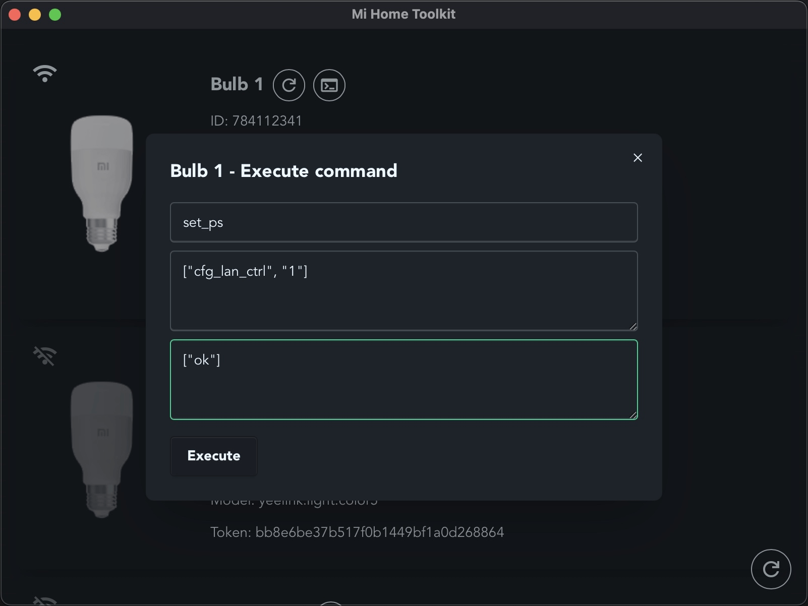

<div align="center">

  
  <h1> Mi Home Toolkit</h1>

</div>

A versatile tool for managing Mi Home smart devices.

## Features

- View device information, such as `token`, `ip`, `did`
- Enable LAN mode for bulbs
- Execute device commands
- Handle login for 2FA-enabled Xiaomi accounts
- Solve captcha during login

## Usage

### 1. Login


### 2. Use the app




## Download

[Releases](../../releases)

## Install dependencies

```sh
pnpm i
```

MiHomeToolkit Windows / MacOS app.

## Run on dev mode

```sh
pnpm tauri dev
```

## Build

```sh
pnpm tauri build
```

### Generate icons scripts

```sh
sh generate-icns.sh <path-to-icon 1024x1024px>
sh generate-ico.sh <path-to-icon 1024x1024px>
```

## Why desktop app?

It's not feasible for browser use due to the inability to read response headers within the browser environment

## Similar projects

- [[Python] python-miio](https://github.com/rytilahti/python-miio) - [pypi](https://pypi.org/project/python-miio/)
- [[Node.js] Homey app for Xiaomi Mi Home devices](https://github.com/jghaanstra/com.xiaomi-miio/)
- [[Rust] miio-proto](https://github.com/johnlepikhin/miio-proto) - [crate](https://crates.io/crates/miio-proto) - control Xiaomi devices over WiFi/UDP
- [[Node.js] homebridge-miot](https://github.com/merdok/homebridge-miot) - [npm](https://www.npmjs.com/package/homebridge-miot) - supports multiple protocols such as MiCloud and Miio
- [[Node.js] node-mihome](https://github.com/maxinminax/node-mihome) - [npm](https://www.npmjs.com/package/node-mihome) - supports multiple protocols such as MiCloud, Miio, and Aqara (ZigBee)
- [[Python] Xiaomi-cloud-tokens-extractor](https://github.com/PiotrMachowski/Xiaomi-cloud-tokens-extractor)
