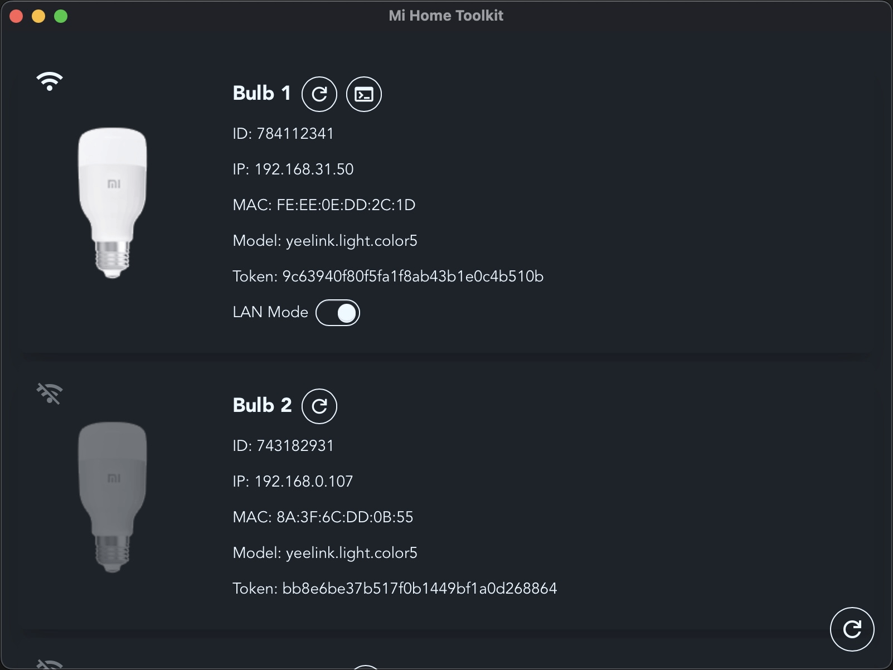

<div align="center">

  
  <h1> Mi Home Toolkit</h1>

</div>

A versatile tool for managing Mi Home smart devices.

## Features

- View device information, such as `token`, `ip`, `did`
- Enable LAN mode for bulbs

## Usage

### 1. Login


### 2. Use the app



## Download

[Releases](../../releases)

## Install dependencies

```sh
pnpm i
```

MiHomeToolkit Windows / MacOS app.

## Run on dev mode

```sh
pnpm tauri dev
```

## Build

```sh
pnpm tauri build
```

### Generate icons scripts

```sh
sh generate-icns.sh <path-to-icon 1024x1024px>
sh generate-ico.sh <path-to-icon 1024x1024px>
```

## Why desktop app?

It's not feasible for browser use due to the inability to read response headers within the browser environment
